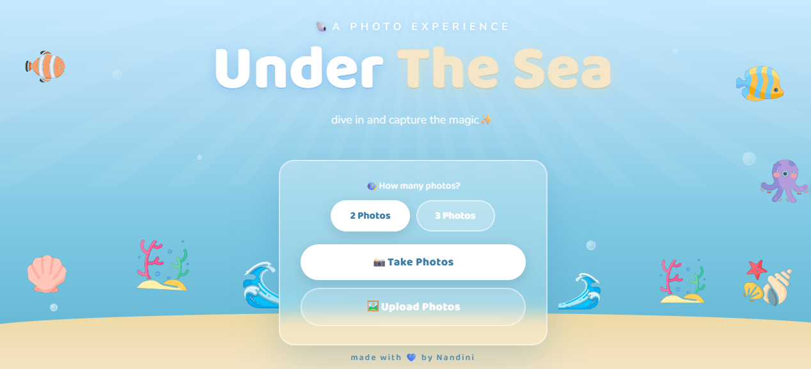
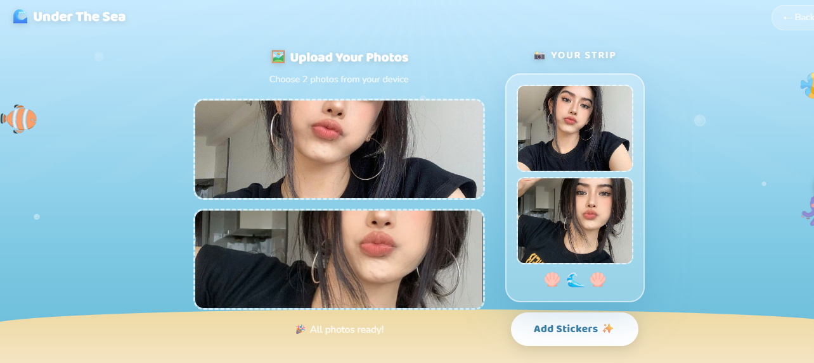
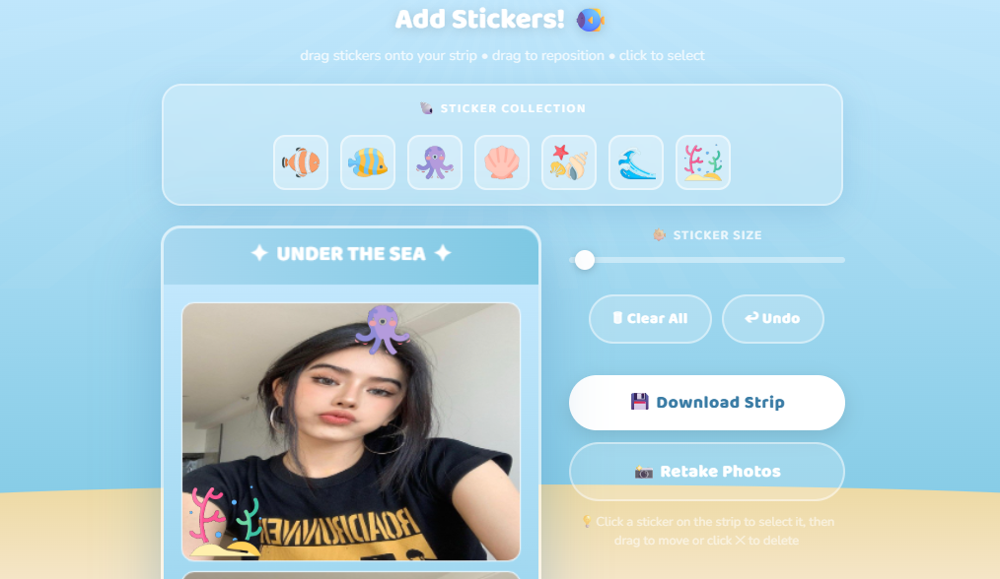
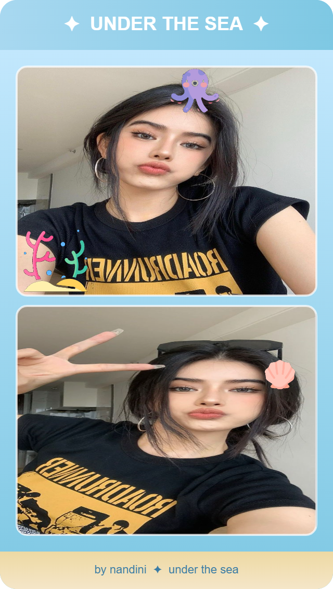

# 🌊Under The Sea — Ocean Photo Booth

<p align="center">
  
  
  
  
</p>

<p align="center">
  🌊A fun, ocean-themed photo booth experience built entirely with Vanilla JavaScript — take photos, add stickers, and download your strip!🐠
</p>

---

## 🌟About the Project

**Under The Sea** is a fully browser-based photo booth web app with an ocean aesthetic. It lets users take photos directly from their webcam or upload their own, arrange them into a photo strip, decorate with stickers, and download the final result.

No frameworks. No libraries. Just clean, handcrafted Vanilla JS.

Users simply:

✤Choose 2 or 3 photos via the landing page toggle  
✤Take photos with their webcam OR upload their own  
✤Decorate with ocean-themed stickers  
✤Download their finished photo strip  

> This project was built as a creative frontend challenge to practice DOM manipulation, Canvas API, and real-world UI problem solving — all without any frameworks.

---

## 🚀Features

- ✤ **Live Webcam Capture** – Take photos directly from your browser with a mirrored preview
- ✤ **Upload Mode** – Skip the camera and upload your own photos instead
- ✤ **2 or 3 Photo Choice** – Pick your strip length from the landing page
- ✤ **Sticker Editor** – Decorate your photo strip with ocean-themed stickers
- ✤ **Canvas-Based Rendering** – Photo strip is composited using the HTML5 Canvas API
- ✤ **Downloadable Strip** – Save your finished strip as an image with one click
- ✤ **Mirror Fix** – Live preview and captured photos are both correctly un-mirrored
- ✤ **Fully Responsive** – Works on desktop and mobile browsers

---

## 🛠Tech Stack

| Category | Technology |
|---|---|
| 💻 Frontend | HTML5, CSS3, Vanilla JavaScript |
| 📸 Camera | WebRTC getUserMedia API |
| 🎨 Image Rendering | HTML5 Canvas API |
| 🌍 Deployment | Netlify |

---

## 🧠How It Works

The project follows a simple multi-page flow:

```
Landing Page (index.html)
        ↓
Photo Count Selection (2 or 3 via URL param)
        ↓
Camera / Upload Mode (booth.html)
        ↓
Canvas Frame Capture & Strip Assembly
        ↓
Sticker Editor (stickers.html)
        ↓
Final Strip Download
```

✤ Everything runs in the browser — no backend needed  
✤ URL parameters carry state between pages  
✤ Canvas API handles all image compositing  

---

## 📊What Was Built & Fixed

SkillScan generates a structured analysis including:

- 🏠 Landing page cleanup — removed confusing strip preview from the booth card
- 📸 Camera mirror fix — live preview and saved photo both display correctly
- 🔢 Dynamic 2 or 3 photo choice — passed via URL param, everything adapts automatically
- 🐙 Sticker editor fixed for 3 photos — strip height, loops, and footer position all dynamic
- 🖼️ Upload mode fully working — sticker editor and download button appear correctly
- 🌟 Favicon added across all 3 pages
- 🎨 UI polish — ocean blue credit line, Nunito subtitle font, pill toggle picker

**Example fix:**

| | |
|---|---|
| **Before** | `STRIP_H` hardcoded for 2 photos only |
| **After** | `computeStripH()` calculates dynamically based on `PHOTO_COUNT` |

---

## 📱App Screens

> 📌Screenshots captured directly from the Under The Sea Photo Booth

<p align="center">
  <b>🌊Landing Page</b>
</p>

<p align="center">
  
</p>

<p align="center">
  <b>📸Camera Booth</b>
</p>

<p align="center">
  
</p>

<p align="center">
  <b>🐙Sticker Editor</b>
</p>

<p align="center">
  
</p>

<p align="center">
  <b>🖼️Final Strip Download</b>
</p>

<p align="center">
  
</p>

---

## 🌐Live Demo

🚀**Try Under The Sea here:** [https://under-the-sea-photobooth.netlify.app](https://under-the-sea-photobooth.netlify.app)

---

## ⚙️How to Run the Project

### 1️⃣Clone the Repository

```bash
git clone https://github.com/saxena-693/under-the-sea-photobooth.git
```

### 2️⃣Open Locally

No installation needed! Just open the project in your browser:

```bash
cd under-the-sea-photobooth
open index.html
```

Or use VS Code with the **Live Server** extension for the best experience.

> ⚠️ Camera access requires the page to be served over `localhost` or `https` — opening the file directly may block webcam permissions.

---

## 📁Folder Structure

```
under-the-sea-photobooth/
│
├── html/
|  |── index.html          #Landing page with photo count picker
|  |── booth.html          #Camera & upload mode
|  └── stickers.html       #Sticker editor & download
│
├── css/
│   ├── index.css       #Landing page styles + pill toggle
│   └── booth.css       #Booth & camera styles
│
├── js/
│   ├── index.js        #Landing page logic
│   ├── booth.js        #Camera capture, upload mode, dynamic slots
│   └── stickers.js     #Canvas rendering, sticker placement, download
│
└── assets/
    └── favicon.ico
```

---

## 🔮Future Enhancements

- ✤ More sticker packs and themed overlays
- ✤ Countdown timer before each shot
- ✤ Background filter effects using Canvas
- ✤ Share strip directly to social media
- ✤ Print-ready strip layout option
- ✤ Mobile camera support (front/back toggle)

---

## 👩‍💻Author

**Nandini Saxena**  
🎓B.Tech (Computer Science & Engineering)  
💡Interested in AI, Full-Stack Development & Software Engineering  

**GitHub:** [https://github.com/saxena-693](https://github.com/saxena-693)

---

<p align="center">💙If you like this project, don't forget to star the repository⭐</p>
